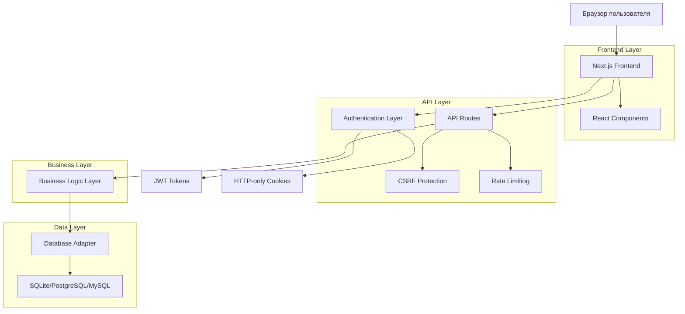

# ТЕХНИЧЕСКОЕ ЗАДАНИЕ
## Система управления проектами и задачами Encore Tasks

---

## 1. ФУНКЦИОНАЛ ПРИЛОЖЕНИЯ

### 1.1 Общее описание системы
Encore Tasks - это веб-приложение для управления проектами и задачами с использованием Kanban-досок. Система предоставляет полный цикл управления проектами от создания до завершения с поддержкой командной работы, уведомлений и детальной аналитики.

### 1.2 Роли пользователей и права доступа

#### 1.2.1 Администратор (admin)
- **Назначение**: Полное управление системой
- **Поведение**: Доступ ко всем функциям системы
- **Права доступа**:
  - Управление пользователями (создание, редактирование, удаление, одобрение)
  - Управление всеми проектами
  - Доступ к панели администрирования
  - Просмотр системной статистики
  - Управление настройками системы

#### 1.2.2 Менеджер (manager)
- **Назначение**: Управление проектами и командами
- **Поведение**: Расширенные права в рамках назначенных проектов
- **Права доступа**:
  - Создание и управление проектами
  - Добавление участников в проекты
  - Управление досками и задачами
  - Просмотр отчетов по проектам

#### 1.2.3 Пользователь (user)
- **Назначение**: Работа с задачами в назначенных проектах
- **Поведение**: Базовые права участника проекта
- **Права доступа**:
  - Просмотр назначенных проектов
  - Создание и редактирование задач
  - Комментирование задач
  - Изменение статуса задач

### 1.3 Основные страницы и их функционал

#### 1.3.1 Страница аутентификации (AuthModal)
- **Назначение**: Вход и регистрация пользователей
- **Элементы интерфейса**:
  - Поле ввода email
  - Поле ввода пароля
  - Кнопка "Войти"
  - Ссылка "Регистрация"
  - Поле ввода имени (для регистрации)
  - Кнопка "Зарегистрироваться"
- **Логика взаимодействия**:
  - Валидация полей ввода
  - Отправка запроса на сервер
  - Установка токенов аутентификации
  - Перенаправление на главную страницу

#### 1.3.2 Главная страница (HomePage)
- **Назначение**: Обзор активности и быстрый доступ к функциям
- **Элементы интерфейса**:
  - Виджет статистики проектов
  - Список последних задач
  - Календарь с дедлайнами
  - Быстрые действия
- **Логика взаимодействия**:
  - Загрузка данных при открытии
  - Обновление в реальном времени
  - Навигация к детальным страницам

#### 1.3.3 Страница досок (KanbanBoard)
- **Назначение**: Основная рабочая область для управления задачами
- **Элементы интерфейса**:
  - Колонки статусов (Todo, In Progress, Review, Done)
  - Карточки задач
  - Кнопка создания задачи
  - Фильтры и сортировка
  - Поиск по задачам
- **Логика взаимодействия**:
  - Drag & Drop для перемещения задач
  - Модальные окна для редактирования
  - Автосохранение изменений
  - Обновление позиций задач

#### 1.3.4 Страница календаря (CalendarPage)
- **Назначение**: Просмотр задач в календарном формате
- **Элементы интерфейса**:
  - Календарная сетка
  - Индикаторы задач по дням
  - Фильтры по проектам
  - Переключение видов (месяц/неделя/день)
- **Логика взаимодействия**:
  - Навигация по датам
  - Клик по дню для просмотра задач
  - Создание задач с выбранной датой

#### 1.3.5 Страница команды (TeamPage)
- **Назначение**: Управление участниками проектов
- **Элементы интерфейса**:
  - Список участников
  - Карточки пользователей с аватарами
  - Статистика по участникам
  - Кнопки управления ролями
- **Логика взаимодействия**:
  - Добавление новых участников
  - Изменение ролей
  - Просмотр активности участников

#### 1.3.6 Страница настроек (SettingsPage)
- **Назначение**: Конфигурация пользовательских настроек
- **Элементы интерфейса**:
  - Переключатель темы (светлая/темная/авто)
  - Выбор языка (русский/английский)
  - Настройки уведомлений
  - Настройки отображения
- **Логика взаимодействия**:
  - Сохранение в localStorage
  - Применение изменений в реальном времени
  - Синхронизация с сервером

#### 1.3.7 Панель администрирования (AdminPanel)
- **Назначение**: Управление системой (только для администраторов)
- **Элементы интерфейса**:
  - Список пользователей
  - Кнопки одобрения/отклонения
  - Статистика системы
  - Системные настройки
- **Логика взаимодействия**:
  - Массовые операции с пользователями
  - Просмотр логов системы
  - Управление правами доступа

### 1.4 Модальные окна и их функционал

#### 1.4.1 Создание проекта (CreateProjectModal)
- **Элементы интерфейса**:
  - Поле названия проекта
  - Поле описания
  - Выбор цвета
  - Выбор иконки
  - Кнопки "Создать" и "Отмена"
- **Валидация**:
  - Обязательность названия
  - Уникальность названия
  - Ограничение длины описания

#### 1.4.2 Создание задачи (CreateTaskModal)
- **Элементы интерфейса**:
  - Поле заголовка
  - Поле описания
  - Выбор приоритета
  - Выбор исполнителя
  - Выбор дедлайна
  - Теги
- **Валидация**:
  - Обязательность заголовка
  - Валидация дедлайна
  - Проверка существования исполнителя

#### 1.4.3 Редактирование задачи (TaskModal)
- **Элементы интерфейса**:
  - Все поля из создания
  - История изменений
  - Комментарии
  - Вложения
  - Подзадачи
- **Функционал**:
  - Автосохранение
  - Отслеживание изменений
  - Уведомления участников

### 1.5 Боковая панель (Sidebar)

#### 1.5.1 Навигационное меню
- **Главная** - переход на HomePage
- **Доски** - переход на KanbanBoard
- **Календарь** - переход на CalendarPage
- **Команда** - переход на TeamPage
- **Администрирование** - переход на AdminPanel (только для админов)
- **Настройки** - переход на SettingsPage

#### 1.5.2 Список проектов
- **Элементы интерфейса**:
  - Иконка проекта
  - Название проекта
  - Кнопка создания проекта (+)
  - Кнопка сворачивания/разворачивания
- **Логика взаимодействия**:
  - Клик по проекту - выбор активного проекта
  - Загрузка досок выбранного проекта
  - Контекстное меню для управления проектом

#### 1.5.3 Список досок
- **Элементы интерфейса**:
  - Название доски
  - Количество задач
  - Кнопка создания доски
- **Логика взаимодействия**:
  - Клик по доске - переход к доске
  - Автоматическое обновление счетчиков

### 1.6 Верхняя панель (TopBar)

#### 1.6.1 Элементы интерфейса
- **Кнопка сворачивания сайдбара** (гамбургер-меню)
- **Хлебные крошки** - навигация по иерархии
- **Поиск** - глобальный поиск по задачам
- **Уведомления** - колокольчик с счетчиком
- **Профиль пользователя** - аватар и меню

#### 1.6.2 Логика взаимодействия
- Адаптивное отображение на мобильных устройствах
- Автодополнение в поиске
- Выпадающее меню уведомлений
- Меню профиля с выходом из системы

---

## 2. ТЕХНИЧЕСКАЯ АРХИТЕКТУРА

### 2.1 Технологический стек

#### 2.1.1 Frontend
- **React 19.0.0** - основной фреймворк
- **Next.js 15.3.5** - фреймворк для SSR и маршрутизации
- **TypeScript 5** - типизация
- **Tailwind CSS 3.4.1** - стилизация
- **Lucide React 0.535.0** - иконки
- **@dnd-kit** - drag & drop функциональность
- **date-fns 4.1.0** - работа с датами
- **clsx 2.1.1** - условные CSS классы
- **zod 4.0.17** - валидация данных

#### 2.1.2 Backend
- **Next.js API Routes** - серверная логика
- **Node.js** - среда выполнения
- **TypeScript** - типизация серверного кода

#### 2.1.3 База данных
- **SQLite** (better-sqlite3 12.2.0) - основная БД для разработки
- **PostgreSQL** (pg 8.16.3) - продакшн БД
- **MySQL** (mysql2 3.14.3) - альтернативная БД

#### 2.1.4 Аутентификация и безопасность
- **JSON Web Tokens** (jsonwebtoken 9.0.2) - токены доступа
- **bcryptjs 2.4.3** - хеширование паролей
- **CSRF защита** - защита от межсайтовых запросов
- **HTTP-only cookies** - безопасное хранение токенов

#### 2.1.5 Дополнительные библиотеки
- **uuid 11.1.0** - генерация уникальных идентификаторов
- **dotenv 17.2.1** - управление переменными окружения
- **node-fetch 3.3.2** - HTTP запросы

### 2.2 Архитектурная схема



### 2.3 Структура проекта

```
src/
├── app/                    # Next.js App Router
│   ├── api/               # API эндпоинты
│   │   ├── auth/          # Аутентификация
│   │   ├── projects/      # Управление проектами
│   │   ├── boards/        # Управление досками
│   │   ├── tasks/         # Управление задачами
│   │   ├── users/         # Управление пользователями
│   │   └── admin/         # Административные функции
│   ├── globals.css        # Глобальные стили
│   ├── layout.tsx         # Корневой layout
│   └── page.tsx           # Главная страница
├── components/            # React компоненты
│   ├── pages/            # Компоненты страниц
│   ├── auth/             # Компоненты аутентификации
│   ├── boards/           # Компоненты досок
│   └── notifications/    # Компоненты уведомлений
├── contexts/             # React контексты
│   └── AppContext.tsx    # Главный контекст приложения
├── hooks/                # Пользовательские хуки
├── lib/                  # Утилиты и адаптеры
│   ├── api.ts           # API клиент
│   ├── auth.ts          # Логика аутентификации
│   ├── database-adapter.ts # Адаптер базы данных
│   └── utils.ts         # Вспомогательные функции
├── services/             # Бизнес-логика
│   ├── interfaces/       # Интерфейсы сервисов
│   └── implementations/  # Реализации сервисов
├── types/                # TypeScript типы
└── utils/                # Утилиты
```

### 2.4 API эндпоинты

#### 2.4.1 Аутентификация
- `POST /api/auth/login` - вход в систему
- `POST /api/auth/register` - регистрация
- `POST /api/auth/logout` - выход из системы
- `GET /api/auth/me` - получение текущего пользователя
- `POST /api/auth/refresh` - обновление токена

#### 2.4.2 Пользователи
- `GET /api/users` - список пользователей
- `GET /api/users/[id]` - получение пользователя
- `PUT /api/users/[id]` - обновление пользователя
- `DELETE /api/users/[id]` - удаление пользователя

#### 2.4.3 Проекты
- `GET /api/projects` - список проектов
- `POST /api/projects` - создание проекта
- `GET /api/projects/[id]` - получение проекта
- `PUT /api/projects/[id]` - обновление проекта
- `DELETE /api/projects/[id]` - удаление проекта
- `GET /api/projects/[id]/members` - участники проекта
- `POST /api/projects/[id]/members` - добавление участника

#### 2.4.4 Доски
- `GET /api/boards` - список досок
- `POST /api/boards` - создание доски
- `GET /api/boards/[id]` - получение доски
- `PUT /api/boards/[id]` - обновление доски
- `DELETE /api/boards/[id]` - удаление доски

#### 2.4.5 Задачи
- `GET /api/tasks` - список задач
- `POST /api/tasks` - создание задачи
- `GET /api/tasks/[id]` - получение задачи
- `PUT /api/tasks/[id]` - обновление задачи
- `DELETE /api/tasks/[id]` - удаление задачи
- `POST /api/tasks/[id]/comments` - добавление комментария

#### 2.4.6 Администрирование
- `GET /api/admin/stats` - системная статистика
- `GET /api/admin/users` - управление пользователями
- `PUT /api/admin/users/[id]/approve` - одобрение пользователя

### 2.5 Система управления состоянием

#### 2.5.1 AppContext
- **Назначение**: Централизованное управление состоянием приложения
- **Состояние**:
  - `currentUser` - текущий пользователь
  - `isAuthenticated` - статус аутентификации
  - `projects` - список проектов
  - `boards` - список досок
  - `tasks` - список задач
  - `users` - список пользователей
  - `notifications` - уведомления
  - `settings` - пользовательские настройки

#### 2.5.2 Reducer Actions
- `SET_LOADING` - установка состояния загрузки
- `LOGIN/LOGOUT` - управление аутентификацией
- `SET_PROJECTS/ADD_PROJECT/UPDATE_PROJECT/DELETE_PROJECT` - управление проектами
- `SET_TASKS/ADD_TASK/UPDATE_TASK/DELETE_TASK` - управление задачами
- `SET_FILTERS/SET_SORT` - управление фильтрами
- `ADD_NOTIFICATION/MARK_NOTIFICATION_READ` - управление уведомлениями

### 2.6 Система аутентификации

#### 2.6.1 Механизм аутентификации
- **JWT токены** для идентификации пользователей
- **HTTP-only cookies** для безопасного хранения токенов
- **CSRF токены** для защиты от межсайтовых запросов
- **Автоматическое обновление токенов**

#### 2.6.2 Процесс аутентификации
1. Пользователь вводит email и пароль
2. Сервер проверяет учетные данные
3. При успехе создается JWT токен и сессия
4. Токен сохраняется в HTTP-only cookie
5. Клиент получает данные пользователя
6. Устанавливается состояние аутентификации

#### 2.6.3 Проверка прав доступа
- **verifyAuth** - проверка валидности токена
- **requireAdmin** - проверка административных прав
- **verifyProjectAccess** - проверка доступа к проекту

---

## 3. ДЕТАЛИ РЕАЛИЗАЦИИ

### 3.1 Алгоритмы ключевых функций

#### 3.1.1 Drag & Drop для задач
```typescript
// Алгоритм перемещения задач между колонками
function handleDragEnd(event: DragEndEvent) {
  const { active, over } = event;
  
  if (!over) return;
  
  const activeTask = findTaskById(active.id);
  const overColumn = findColumnById(over.id);
  
  if (activeTask && overColumn) {
    // Вычисление новой позиции
    const newPosition = calculateNewPosition(overColumn, activeTask);
    
    // Обновление задачи
    updateTask(activeTask.id, {
      status: overColumn.status,
      position: newPosition
    });
    
    // Обновление позиций других задач
    reorderTasks(overColumn, newPosition);
  }
}
```

#### 3.1.2 Система фильтрации задач
```typescript
// Алгоритм фильтрации и сортировки задач
function filterAndSortTasks(tasks: Task[], filters: Filters, sort: SortConfig) {
  let filteredTasks = tasks;
  
  // Применение фильтров
  if (filters.assignee) {
    filteredTasks = filteredTasks.filter(task => 
      task.assignees.some(assignee => assignee.id === filters.assignee)
    );
  }
  
  if (filters.priority) {
    filteredTasks = filteredTasks.filter(task => task.priority === filters.priority);
  }
  
  if (filters.status) {
    filteredTasks = filteredTasks.filter(task => task.status === filters.status);
  }
  
  // Применение сортировки
  filteredTasks.sort((a, b) => {
    const direction = sort.order === 'asc' ? 1 : -1;
    
    switch (sort.by) {
      case 'priority':
        return comparePriority(a.priority, b.priority) * direction;
      case 'deadline':
        return compareDate(a.deadline, b.deadline) * direction;
      case 'created':
        return compareDate(a.createdAt, b.createdAt) * direction;
      default:
        return 0;
    }
  });
  
  return filteredTasks;
}
```

#### 3.1.3 Система уведомлений
```typescript
// Алгоритм создания и отправки уведомлений
function createTaskNotification(task: Task, action: string, userId: string) {
  const notification: Notification = {
    id: generateId(),
    type: getNotificationType(action),
    title: getNotificationTitle(action, task),
    message: getNotificationMessage(action, task),
    taskId: task.id,
    projectId: task.projectId,
    userId: userId,
    isRead: false,
    createdAt: new Date()
  };
  
  // Отправка уведомления всем участникам проекта
  const projectMembers = getProjectMembers(task.projectId);
  projectMembers.forEach(member => {
    if (member.id !== userId) {
      sendNotification(member.id, notification);
    }
  });
}
```

### 3.2 Обработка исключительных ситуаций

#### 3.2.1 Обработка ошибок API
```typescript
// Централизованная обработка ошибок API
class ApiClient {
  private async request<T>(endpoint: string, options: RequestInit) {
    try {
      const response = await fetch(endpoint, options);
      
      if (!response.ok) {
        switch (response.status) {
          case 401:
            // Неавторизованный доступ
            this.handleUnauthorized();
            throw new Error('Сессия истекла');
          case 403:
            // Недостаточно прав
            throw new Error('Недостаточно прав доступа');
          case 404:
            // Ресурс не найден
            throw new Error('Ресурс не найден');
          case 429:
            // Превышен лимит запросов
            await this.handleRateLimit();
            return this.request(endpoint, options);
          case 500:
            // Ошибка сервера
            throw new Error('Ошибка сервера');
          default:
            throw new Error(`HTTP ${response.status}`);
        }
      }
      
      return await response.json();
    } catch (error) {
      if (error instanceof TypeError) {
        throw new Error('Ошибка сети');
      }
      throw error;
    }
  }
}
```

#### 3.2.2 Обработка ошибок компонентов
```typescript
// Error Boundary для React компонентов
class ErrorBoundary extends React.Component {
  constructor(props) {
    super(props);
    this.state = { hasError: false, error: null };
  }
  
  static getDerivedStateFromError(error) {
    return { hasError: true, error };
  }
  
  componentDidCatch(error, errorInfo) {
    // Логирование ошибки
    console.error('Component error:', error, errorInfo);
    
    // Отправка ошибки в систему мониторинга
    this.reportError(error, errorInfo);
  }
  
  render() {
    if (this.state.hasError) {
      return <ErrorFallback error={this.state.error} />;
    }
    
    return this.props.children;
  }
}
```

#### 3.2.3 Валидация данных
```typescript
// Схемы валидации с использованием Zod
const TaskSchema = z.object({
  title: z.string().min(1, 'Заголовок обязателен').max(200, 'Слишком длинный заголовок'),
  description: z.string().max(2000, 'Слишком длинное описание').optional(),
  priority: z.enum(['low', 'medium', 'high', 'urgent']),
  assigneeId: z.string().uuid('Неверный ID исполнителя').optional(),
  deadline: z.date().min(new Date(), 'Дедлайн не может быть в прошлом').optional(),
  tags: z.array(z.string()).max(10, 'Слишком много тегов')
});

// Использование валидации
function validateTaskData(data: unknown) {
  try {
    return TaskSchema.parse(data);
  } catch (error) {
    if (error instanceof z.ZodError) {
      throw new ValidationError(error.errors);
    }
    throw error;
  }
}
```

### 3.3 Логика хранения и обработки данных

#### 3.3.1 Адаптер базы данных
```typescript
// Универсальный адаптер для работы с разными БД
class DatabaseAdapter {
  private db: Database;
  
  constructor(type: 'sqlite' | 'postgresql' | 'mysql') {
    this.db = this.createConnection(type);
  }
  
  // Методы для работы с пользователями
  async getUserById(id: string): Promise<User | null> {
    const query = 'SELECT * FROM users WHERE id = ?';
    const result = await this.db.get(query, [id]);
    return result ? this.mapToUser(result) : null;
  }
  
  async createUser(userData: CreateUserData): Promise<User> {
    const query = `
      INSERT INTO users (id, name, email, password_hash, role, approval_status)
      VALUES (?, ?, ?, ?, ?, ?)
    `;
    
    const id = generateId();
    await this.db.run(query, [
      id, userData.name, userData.email, 
      userData.passwordHash, userData.role, 'pending'
    ]);
    
    return this.getUserById(id);
  }
  
  // Методы для работы с проектами
  async getProjectsByUserId(userId: string): Promise<Project[]> {
    const query = `
      SELECT p.* FROM projects p
      JOIN project_members pm ON p.id = pm.project_id
      WHERE pm.user_id = ?
    `;
    
    const results = await this.db.all(query, [userId]);
    return results.map(this.mapToProject);
  }
  
  // Методы для работы с задачами
  async getTasksByBoardId(boardId: string): Promise<Task[]> {
    const query = `
      SELECT t.*, u.name as reporter_name
      FROM tasks t
      JOIN users u ON t.reporter_id = u.id
      WHERE t.board_id = ?
      ORDER BY t.position ASC
    `;
    
    const results = await this.db.all(query, [boardId]);
    return Promise.all(results.map(this.mapToTask));
  }
}
```

#### 3.3.2 Кэширование данных
```typescript
// Система кэширования для оптимизации производительности
class CacheManager {
  private cache = new Map<string, CacheEntry>();
  private readonly TTL = 5 * 60 * 1000; // 5 минут
  
  set(key: string, value: any): void {
    this.cache.set(key, {
      value,
      timestamp: Date.now()
    });
  }
  
  get(key: string): any | null {
    const entry = this.cache.get(key);
    
    if (!entry) return null;
    
    if (Date.now() - entry.timestamp > this.TTL) {
      this.cache.delete(key);
      return null;
    }
    
    return entry.value;
  }
  
  invalidate(pattern: string): void {
    for (const key of this.cache.keys()) {
      if (key.includes(pattern)) {
        this.cache.delete(key);
      }
    }
  }
}
```

#### 3.3.3 Оптимистичные обновления
```typescript
// Система оптимистичных обновлений для улучшения UX
class OptimisticUpdates {
  private pendingUpdates = new Map<string, any>();
  
  async updateTask(taskId: string, updates: Partial<Task>): Promise<void> {
    // Сохраняем оригинальное состояние
    const originalTask = this.getTask(taskId);
    this.pendingUpdates.set(taskId, originalTask);
    
    // Применяем изменения локально
    this.applyLocalUpdate(taskId, updates);
    
    try {
      // Отправляем на сервер
      await this.api.updateTask(taskId, updates);
      
      // Удаляем из pending при успехе
      this.pendingUpdates.delete(taskId);
    } catch (error) {
      // Откатываем изменения при ошибке
      this.revertUpdate(taskId);
      throw error;
    }
  }
  
  private revertUpdate(taskId: string): void {
    const originalTask = this.pendingUpdates.get(taskId);
    if (originalTask) {
      this.applyLocalUpdate(taskId, originalTask);
      this.pendingUpdates.delete(taskId);
    }
  }
}
```

### 3.4 Система безопасности

#### 3.4.1 CSRF защита
```typescript
// Middleware для защиты от CSRF атак
export function csrfProtection(req: NextRequest) {
  const token = req.headers.get('X-CSRF-Token');
  const cookieToken = req.cookies.get('csrf-token')?.value;
  
  if (!token || !cookieToken || token !== cookieToken) {
    throw new Error('CSRF token mismatch');
  }
}
```

#### 3.4.2 Rate Limiting
```typescript
// Ограничение частоты запросов
class RateLimiter {
  private requests = new Map<string, number[]>();
  private readonly limit = 100; // запросов
  private readonly window = 60 * 1000; // за минуту
  
  isAllowed(clientId: string): boolean {
    const now = Date.now();
    const clientRequests = this.requests.get(clientId) || [];
    
    // Удаляем старые запросы
    const recentRequests = clientRequests.filter(
      timestamp => now - timestamp < this.window
    );
    
    if (recentRequests.length >= this.limit) {
      return false;
    }
    
    recentRequests.push(now);
    this.requests.set(clientId, recentRequests);
    
    return true;
  }
}
```

### 3.5 Система уведомлений

#### 3.5.1 Типы уведомлений
- **task_assigned** - назначение задачи
- **task_completed** - завершение задачи
- **task_updated** - обновление задачи
- **task_created** - создание задачи
- **deadline_reminder** - напоминание о дедлайне

#### 3.5.2 Каналы доставки
- **В приложении** - через NotificationSystem компонент
- **Email** - через SMTP сервер
- **Push-уведомления** - через Service Worker
- **Telegram** - через Telegram Bot API

### 3.6 Система настроек

#### 3.6.1 Пользовательские настройки
```typescript
interface UserSettings {
  theme: 'dark' | 'light' | 'auto';
  language: 'ru' | 'en';
  compactMode: boolean;
  showAvatars: boolean;
  emailNotifications: boolean;
  pushNotifications: boolean;
  taskReminders: boolean;
  telegramNotifications: boolean;
  taskAssigned: boolean;
  taskCompleted: boolean;
  deadlineReminder: boolean;
  projectUpdates: boolean;
}
```

#### 3.6.2 Сохранение настроек
- **localStorage** - для клиентских настроек
- **База данных** - для серверных настроек
- **Синхронизация** - между устройствами пользователя

---

## 4. ЗАКЛЮЧЕНИЕ

Данное техническое задание описывает полнофункциональную систему управления проектами и задачами Encore Tasks. Система построена на современных технологиях и следует лучшим практикам разработки веб-приложений.

### Ключевые особенности:
- Модульная архитектура с четким разделением ответственности
- Типобезопасность на всех уровнях приложения
- Комплексная система безопасности
- Оптимизированная производительность
- Адаптивный и современный интерфейс
- Масштабируемая архитектура базы данных

Система готова к развертыванию и дальнейшему развитию с возможностью добавления новых функций и интеграций.